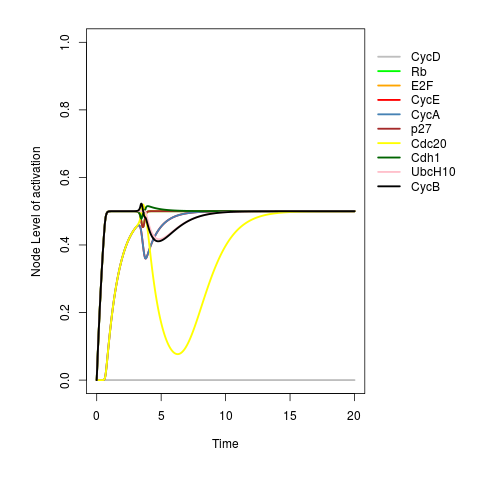

# SQUAD
## Standardized Qualitative Analysis of Dynamical Systems 

The aim of the proyect is to implement the updated version of the Standardized Qualitative Analysis of Dynamical Systems (SQUAD) method described in Martínez-Sosa in 2013 (1), as modified from the first version in Di Cara, 2007 (2). 


### BRN continuous interpolation

SQUAD automate Boolean Regulatory Network (BRN) transformation
to continuous models. 

```r
library(SQUAD)

## loading BRN model
data("cellcycle") 
cellcycle

## BRN to continuous transformation
cellcycle.sq <- asContinuous(cellcycle) 
 
## initial State definition 
initialState <- rep(0,length(cellcycle$genes)) 
 
## running simulation 
squad(cellcycle, 
       initialState = initialState) 
```




See the documentation of the project [here](https://caramirezal.github.io/squadTutorial/index.html).

References

Di Cara, A., Garg, A., De Micheli, G., Xenarios, I., & Mendoza, L. (2007). Dynamic simulation of regulatory networks using SQUAD. BMC Bioinformatics, 8(1), 462. http://doi.org/10.1186/1471-2105-8-462

Martínez-Sosa, P., & Mendoza, L. (2013). The regulatory network that controls the differentiation of T lymphocytes. BioSystems, 113(2), 96–103. http://doi.org/10.1016/j.biosystems.2013.05.007
